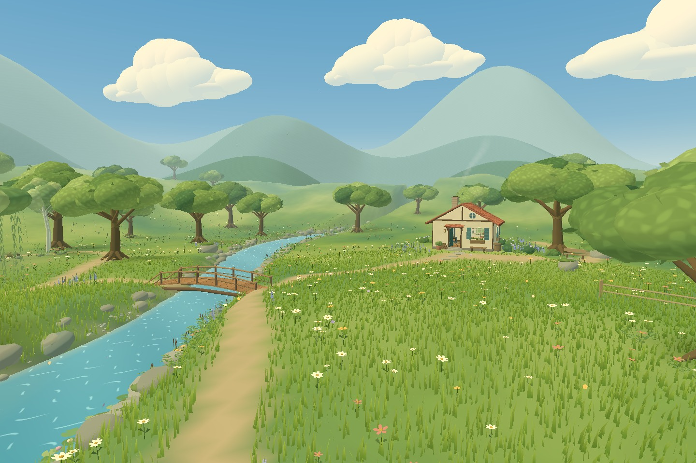
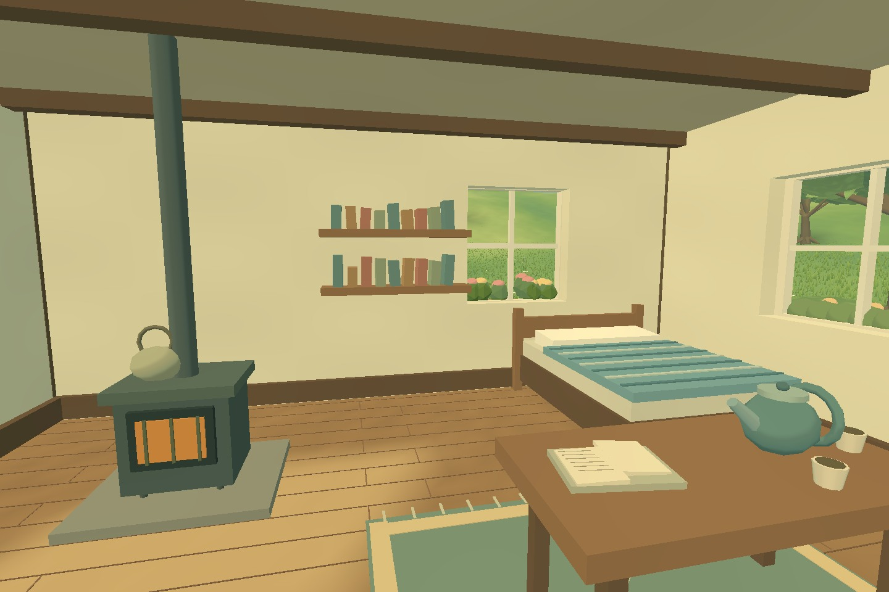

# Celworld

[Open Celworld in your Quest browser](https://permabulk69420-pixel.github.io/-Celworld/)

A small, sunlit, Ghibli-inspired world built in Three.js for Meta Quest 3. The valley is a place to wander: thick moving grass, wildflowers, spreading trees, a winding stream, a wooden bridge, a furnished cottage, and a woodland path leading to a quiet landing beneath a willow.



Local scene renders use the project's geometry and approximate its material appearance. They are visual checks, not browser or headset captures. [Standing-height view](docs/standing-view.jpg) · [The repaired river bend](docs/riverbank.jpg) · [Cottage details](docs/cottage.jpg).

## Version 0.3 — the open cottage and the willow trail

- Walk through the open cottage door into a furnished room. A quilted bed, tea table, bookshelves, woven rug, window seat and warm stove sit beneath timber beams. Clear windows look back into the garden.
- Follow a new woodland loop through pale birches, shaded grass, ferns, fallen timber, mushrooms and scattered leaves. Two benches provide places to pause along the trail.
- Visit the weeping willow beside a widened pool. Hanging foliage moves in the breeze; a wooden ramp leads to a railed landing with a bench and book, overlooking lily pads and water flowers.
- Optional procedural ambience adds quiet wind, river water, occasional birds and a crackling stove. Sound follows the viewer and softens inside the cottage; it stops when leaving the scene or pausing VR.
- The version 0.2 river repair remains in place: water is clipped against the actual ground triangles, and dry banks, vegetation and player ground sampling share the same terrain surface.

The movement, controller mapping and Quest rendering settings are unchanged. This remains a world for exploration, with decorative furnishings and no new game mechanics.



[The willow and waterside landing](docs/willow.jpg) · [The birch trail](docs/woodland.jpg) · [Looking upstream from the landing](docs/landing.jpg).

## Play

Open the deployed GitHub Pages site in the Quest browser and choose **Enter VR**. Use Touch controllers:

| Control | Action |
| --- | --- |
| Left stick | Smooth, head-relative movement |
| Right stick | Smooth turning |
| Left grip, or left stick click | Hold to run |
| A | Jump |
| Quest system menu | Leave the VR session |

Movement uses real-world metres and a floor reference space. Turning pivots around the headset, including when you have moved away from the centre of your play area. Jumping has gravity and requires a new button press for each jump.

On a phone or computer, **Look around** opens a simple orbit view of the same scene. Drag to rotate; pinch or scroll to move closer.

Choose **Ambience on/off** before entering VR, or while using the desktop view. Audio begins only after choosing **Enter VR** or **Look around**. It is generated locally with Web Audio; there are no audio downloads or microphone access. The world also works with sound muted or unavailable.

## Development

Use Node.js 22 or newer.

```sh
npm ci
npm run dev
npm test
npm run build
```

The deployment workflow builds on every push to `main` and publishes `dist/` to GitHub Pages. Keep **Settings → Pages → Source** set to **GitHub Actions**. The relative asset base supports this repository's Pages subdirectory.

All runtime code is bundled locally. There are no remote model, texture, font, audio, or controller-asset dependencies and no API keys.

## Direction

Keep this an inviting world first. The visual language is warm cream and clay architecture, layered green foliage, broad painted light and shadow, turquoise water, and a large summer sky. Work in believable human scale. Preserve the quiet atmosphere and add detail to places a player can actually visit.

The scope is scenery and locomotion. Future iterations can extend the walking routes, deepen the cottage garden and woodland clearings, and refine the atmosphere after headset feedback. New mechanics should follow a conversation with the user.

## Source map

| File | Responsibility |
| --- | --- |
| `src/world.js` | Assembles the scene; also usable without a browser |
| `src/land.js` | Shared terrain, stream, paths, bridge, cottage floor and landing heights |
| `src/materials.js` | Painted lighting, wind, grass, water and distance haze |
| `src/terrain.js` | Ground, stream surface and layered distant hills |
| `src/vegetation.js` | Trees, canopy leaves, grass patches and wildflowers |
| `src/undergrowth.js` | Ferns, reeds, lupines, shrubs and hydrangeas |
| `src/props.js` | Cottage, tile roof, bridge, stones, fence and bench |
| `src/interior.js` | Cottage wall openings, clear windows, furnishings and collision shapes |
| `src/grove.js` | Willow, landing, lily pads and woodland details |
| `src/atmosphere.js` | Sky, clouds, chimney smoke, birds and butterflies |
| `src/ambience.js` | Procedural sound, spatial listening and audio lifecycle |
| `src/locomotion.js` | Controller mapping, collision and player motion |
| `src/xr-pose.js` | Current headset pose in the locomotion rig's world space |
| `src/main.js` | Renderer, XR lifecycle, hand silhouettes and orbit preview |
| `tools/render-scene.mjs` | Approximate CPU scene renders for geometry and composition review |

## Rendering approach

- Instanced, opaque grass blades with wind calculated on the GPU.
- Grass is grouped into spatial patches, culled by distance, and shrinks away between 40–60 metres.
- Instanced foliage, leaves, stones and flowers; static architectural details are merged.
- Detailed fern instances use spatial batches for frustum culling. The water remains a single opaque surface, with no extra reflection render pass.
- Willow strands and birch crowns are instanced; cottage furnishings and woodland details are merged. Only the small window panes use transparent glass.
- Three-tone lighting, layered haze and baked ground colour provide depth without full-screen effects.
- No screen-space reflections, bloom, real-time shadow passes, or alpha-cutout grass.
- Quest settings request 72 Hz when supported, a 0.95 framebuffer scale and fixed foveation of 0.7.

The owner reported that the initial build looks and runs well on Quest 3. That feedback is not a measured frame-rate claim; the new scenery, interior and audio still need an on-device check.

## Validation

`npm test` runs 17 checks covering controller handedness, stick drift, headset-centred turning, diagonal speed, sprinting, single-press jumping, narrow-wall collisions, a continuous bridge floor, current headset pose transforms and tracking loss. River regressions check both banks along the stream, every exposed water edge against the ground, and the actual grass and flower instances for submerged roots. Exploration checks build the full scene and verify the open doorway, cottage walls, landing approach and clear woodland trail.

Add `?inspect=1` to show a small diagnostic overlay with draw calls, submitted triangles, vegetation counts and shader errors. Keep this information out of the normal experience.

`npm run render -- interior` writes an approximate CPU render to `renders/interior.ppm`. Other views are `overview`, `ground`, `river`, `bank`, `cottage`, `willow`, `woodland` and `landing`. This tool reads the real scene geometry and approximates the shaders; it does not compile GLSL or measure browser or headset performance. Generated renders are excluded from the runtime bundle.

### Current limits

- Furniture and books are decorative; the cottage door is held open.
- The stream is shallow and walkable.
- There is no saved player position; a new VR session starts at the meadow path.
- The ambience preference lasts for the current page visit and is set before entering VR.
- The provided browser preview has WebGL disabled. Local scene renders inspect source geometry and approximate material appearance, but do not verify WebGL execution, audible playback or a headset session.
