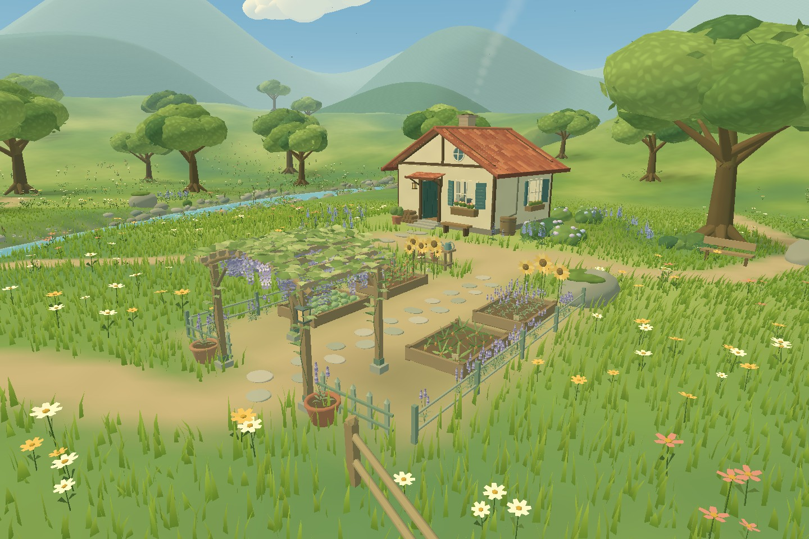

# Celworld

[Open Celworld in your Quest browser](https://permabulk69420-pixel.github.io/-Celworld/)

A small, sunlit, Ghibli-inspired world built in Three.js for Meta Quest 3. The valley is a place to wander: thick moving grass, wildflowers, spreading trees, a winding stream, a furnished cottage and kitchen garden, a lantern bridge, a willow landing, and a woodland trail leading to an old stone well.


Local scene renders use the project's geometry and approximate its material appearance. They are visual checks, not browser or headset captures.

## Version 0.4 — the cottage garden and the woodland well

- A new path loops from the meadow through the cottage kitchen garden. Walk beneath a wisteria arbour and between raised beds of cabbages, carrots, tomatoes and lavender, with sunflowers along the back fence.
- Low sage-coloured fencing, stone pavers, clay pots, a watering can and a planting table give the garden a lived-in feel. Individual vine leaves and hanging flowers sway gently above the entrance.
- A branch of the birch trail leads to a bluebell clearing and an old stone well. Its hollow stone walls contain rippling water beneath a shingled roof, with a wooden windlass, rope and bucket. A stone apron, benches and small lanterns surround the well.
- The arched bridge has stone post bases, lanterns, climbing leaves and finer plank detail.
- Soft painted shadows settle the arbour, planting beds and well into the ground. New planting uses instances and static craft details are merged, with no additional full-screen effects or shadow-map passes.

The movement, controller mapping and Quest rendering settings are unchanged. The furnished cottage, willow landing, repaired riverbanks and optional ambience remain part of the valley. This is a world for exploration; the garden, well and furnishings are decorative.



[Under the wisteria](docs/arbour.jpg) · [The woodland clearing](docs/clearing.jpg) · [The old well](docs/well.jpg) · [The lantern bridge](docs/bridge.jpg).

Earlier scene previews: [Inside the cottage](docs/interior.jpg) · [The willow and landing](docs/willow.jpg) · [The birch trail](docs/woodland.jpg).

## Play

Open the deployed GitHub Pages site in the Quest browser and choose **Enter VR**. Use Touch controllers:

| Control | Action |
| --- | --- |
| Left stick | Smooth, head-relative movement |
| Right stick | Smooth turning |
| Left grip, or left stick click | Hold to run |
| A | Jump |
| Quest system menu | Leave the VR session |

Movement uses real-world metres and a floor reference space. Turning pivots around the headset, including when you have moved away from the centre of your play area. Jumping has gravity and requires a new button press for each jump.

On a phone or computer, **Look around** opens a simple orbit view of the same scene. Drag to rotate; pinch or scroll to move closer.

Choose **Ambience on/off** before entering VR, or while using the desktop view. Audio begins only after choosing **Enter VR** or **Look around**. It is generated locally with Web Audio; there are no audio downloads or microphone access. The world also works with sound muted or unavailable.

To find the new places, take the meadow path towards the cottage garden, or cross the bridge and follow the birch trail to its western branch. The garden has entrances at both ends; you can walk all the way around the well.

## Development

Use Node.js 22 or newer.

```sh
npm ci
npm run dev
npm test
npm run build
```

The deployment workflow builds on every push to `main` and publishes `dist/` to GitHub Pages. Keep **Settings → Pages → Source** set to **GitHub Actions**. The relative asset base supports this repository's Pages subdirectory.

All runtime code is bundled locally. There are no remote model, texture, font, audio, or controller-asset dependencies and no API keys.

## Direction

Keep this an inviting world first. The visual language is warm cream and clay architecture, layered green foliage, broad painted light and shadow, turquoise water, and a large summer sky. Work in believable human scale. Preserve the quiet atmosphere and add detail to places a player can actually visit.

The scope is scenery and locomotion. Future iterations can extend the walking routes, add detail to the existing destinations and refine the atmosphere after headset feedback. Keep new places connected to walkable paths and verify their headroom and collision geometry. New mechanics should follow a conversation with the user.

## Source map

| File | Responsibility |
| --- | --- |
| `src/world.js` | Assembles the scene; also usable without a browser |
| `src/land.js` | Shared terrain, paths, planting reservations and walkable surfaces |
| `src/materials.js` | Painted lighting, wind, grass, water and distance haze |
| `src/terrain.js` | Ground, stream surface and layered distant hills |
| `src/vegetation.js` | Trees, canopy leaves, grass patches and wildflowers |
| `src/undergrowth.js` | Ferns, reeds, lupines, shrubs and hydrangeas |
| `src/props.js` | Cottage, tile roof, bridge, stones, fence and bench |
| `src/interior.js` | Cottage wall openings, clear windows, furnishings and collision shapes |
| `src/grove.js` | Willow, landing, lily pads and woodland details |
| `src/garden.js` | Wisteria arbour, kitchen garden, vegetables and planting table |
| `src/clearing.js` | Woodland well, contained water, bluebells and resting places |
| `src/craft.js` | Reusable leaves, clay pots, buckets, lanterns and benches |
| `src/atmosphere.js` | Sky, clouds, chimney smoke, birds and butterflies |
| `src/ambience.js` | Procedural sound, spatial listening and audio lifecycle |
| `src/locomotion.js` | Controller mapping, collision and player motion |
| `src/xr-pose.js` | Current headset pose in the locomotion rig's world space |
| `src/main.js` | Renderer, XR lifecycle, hand silhouettes and orbit preview |
| `tools/render-scene.mjs` | Approximate CPU scene renders for geometry and composition review |

## Rendering approach

- Instanced, opaque grass blades with wind calculated on the GPU.
- Grass is grouped into spatial patches, culled by distance, and shrinks away between 40–60 metres.
- Instanced foliage, leaves, stones and flowers; static architectural details are merged.
- Detailed fern instances use spatial batches for frustum culling. The water remains a single opaque surface, with no extra reflection render pass.
- Willow strands and birch crowns are instanced; cottage furnishings and woodland details are merged. Only the small window panes use transparent glass.
- Garden crops, wisteria, bluebells and small craft foliage use shared instance batches. The well has a small opaque water surface enclosed by its stone walls.
- Three-tone lighting, layered haze and baked ground colour provide depth without full-screen effects.
- No screen-space reflections, bloom, real-time shadow passes, or alpha-cutout grass.
- Quest settings request 72 Hz when supported, a 0.95 framebuffer scale and fixed foveation of 0.7.

The owner reported that the initial build looks and runs well on Quest 3 and has given positive visual feedback through version 0.3. That feedback is not a measured frame-rate claim; version 0.4 still needs an on-device performance check.

## Validation

`npm test` runs 20 checks covering controller handedness, stick drift, headset-centred turning, diagonal speed, sprinting, single-press jumping, narrow-wall collisions, a continuous bridge floor, current headset pose transforms and tracking loss. River regressions check both banks along the stream, every exposed water edge against the ground, and the actual grass and flower instances for submerged roots. Exploration checks build the full scene and verify the cottage doorway and walls, landing approach, woodland trail, garden entrances, arbour headroom, well approach and complete walking loop around the well.

Add `?inspect=1` to show a small diagnostic overlay with draw calls, submitted triangles, vegetation counts and shader errors. Keep this information out of the normal experience.

`npm run render -- garden` writes an approximate CPU render to `renders/garden.ppm`. Other views are `overview`, `ground`, `river`, `bank`, `cottage`, `interior`, `willow`, `woodland`, `landing`, `arbour`, `clearing`, `well` and `bridge`. This tool reads the real scene geometry and approximates the shaders; it does not compile GLSL or measure browser or headset performance. Generated renders are excluded from the runtime bundle.

### Current limits

- Furniture, books, garden crops and the well are decorative; the cottage door is held open.
- The stream is shallow and walkable.
- There is no saved player position; a new VR session starts at the meadow path.
- The ambience preference lasts for the current page visit and is set before entering VR.
- The provided browser preview has WebGL disabled. Local scene renders inspect source geometry and approximate material appearance, but do not verify WebGL execution, audible playback or a headset session.
