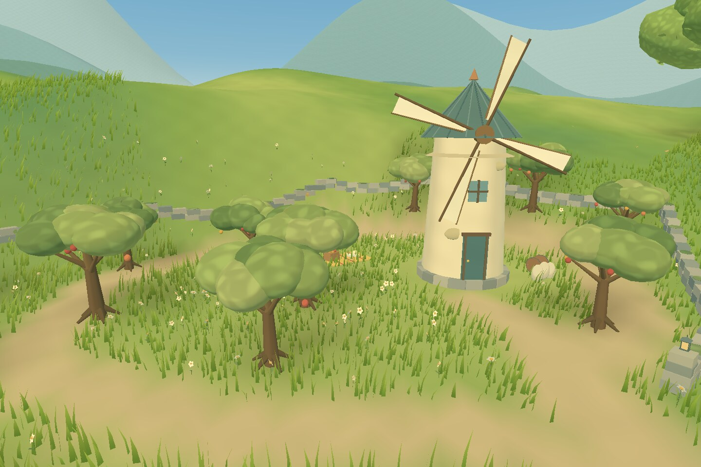

# Celworld

[Open Celworld in your Quest browser](https://permabulk69420-pixel.github.io/-Celworld/)

A small, sunlit, Ghibli-inspired world built in Three.js for Meta Quest 3. The valley is a place to wander: thick moving grass, wildflowers, spreading trees, a winding stream, a furnished cottage and kitchen garden, a lantern bridge, a willow landing, a woodland well, and a path over the ridge to a hidden orchard.


Local scene renders use the project's geometry and approximate its material appearance. They are visual checks, not browser or headset captures.

## Version 0.5 — over the hill

- The cottage-side path now continues south and climbs roughly three metres over a broad grassy ridge. The windmill sails appear first; the orchard floor opens below only as the path reaches the crest.
- A sheltered basin beyond the hill carries twelve small, gnarled fruit trees with layered crowns, red and golden fruit, baked dappled shade and drifting leaves. A complete walking circuit loops through them.
- A weathered cream windmill anchors the new area. Its teal roof, patched plaster, tiny windows and wooden cloth sails are visible from the old valley, while its rotor turns gently up close.
- An old dry-stone wall encloses the orchard without closing it off. A wide lantern gateway meets the ridge path, a spur reaches the mill, and a harvest blanket, apple basket, flour sacks, barrel, moss and tiny ground flowers reward looking around.
- Dense orchard dressing is distance-culled from the spawn meadow. Grass coverage extends across the new southern ground, while the landmark stays visible as a reason to keep walking.

The movement, controller mapping and Quest rendering settings are unchanged. The furnished cottage, kitchen garden, willow landing, repaired riverbanks, woodland well and optional ambience remain part of the valley. This is still a world for exploration; the orchard and windmill are scenery rather than a new game system.



[The climb over the ridge](docs/ridge.jpg) · [At the old windmill](docs/windmill.jpg).

Earlier scene previews: [The cottage kitchen garden](docs/garden.jpg) · [Under the wisteria](docs/arbour.jpg) · [The woodland clearing](docs/clearing.jpg) · [The old well](docs/well.jpg) · [The lantern bridge](docs/bridge.jpg) · [Inside the cottage](docs/interior.jpg) · [The willow and landing](docs/willow.jpg) · [The birch trail](docs/woodland.jpg).

## Play

Open the deployed GitHub Pages site in the Quest browser and choose **Enter VR**. Use Touch controllers:

| Control | Action |
| --- | --- |
| Left stick | Smooth, head-relative movement |
| Right stick | Smooth turning |
| Left grip, or left stick click | Hold to run |
| A | Jump |
| Quest system menu | Leave the VR session |

Movement uses real-world metres and a floor reference space. Turning pivots around the headset, including when you have moved away from the centre of your play area. Jumping has gravity and requires a new button press for each jump.

On a phone or computer, **Look around** opens a simple orbit view of the same scene. Drag to rotate; pinch or scroll to move closer.

Choose **Ambience on/off** before entering VR, or while using the desktop view. Audio begins only after choosing **Enter VR** or **Look around**. It is generated locally with Web Audio; there are no audio downloads or microphone access. The world also works with sound muted or unavailable.

To find the orchard, take the meadow path towards the cottage and keep following it south as it bends away from the house. Climb to the windmill sails above the ridge and pass between the two little lanterns. The orchard path is a complete loop, with a short inner spur to the windmill. The garden still has entrances at both ends, and the bridge-side birch trail still reaches the well.

## Development

Use Node.js 22 or newer.

```sh
npm ci
npm run dev
npm test
npm run build
```

The deployment workflow builds on every push to `main` and publishes `dist/` to GitHub Pages. Keep **Settings → Pages → Source** set to **GitHub Actions**. The relative asset base supports this repository's Pages subdirectory.

All runtime code is bundled locally. There are no remote model, texture, font, audio, or controller-asset dependencies and no API keys.

## Direction

Keep this an inviting world first. The visual language is warm cream and clay architecture, layered green foliage, broad painted light and shadow, turquoise water, and a large summer sky. Work in believable human scale. Preserve the quiet atmosphere and add detail to places a player can actually visit.

The scope is scenery and locomotion. Future iterations can extend the walking routes, add detail to the existing destinations and refine the atmosphere after headset feedback. Keep new places connected to walkable paths and verify their headroom and collision geometry. New mechanics should follow a conversation with the user.

## Source map

| File | Responsibility |
| --- | --- |
| `src/world.js` | Assembles the scene; also usable without a browser |
| `src/land.js` | Shared terrain, paths, planting reservations and walkable surfaces |
| `src/materials.js` | Painted lighting, wind, grass, water and distance haze |
| `src/terrain.js` | Ground, stream surface and layered distant hills |
| `src/vegetation.js` | Trees, canopy leaves, grass patches and wildflowers |
| `src/undergrowth.js` | Ferns, reeds, lupines, shrubs and hydrangeas |
| `src/props.js` | Cottage, tile roof, bridge, stones, fence and bench |
| `src/interior.js` | Cottage wall openings, clear windows, furnishings and collision shapes |
| `src/grove.js` | Willow, landing, lily pads and woodland details |
| `src/garden.js` | Wisteria arbour, kitchen garden, vegetables and planting table |
| `src/clearing.js` | Woodland well, contained water, bluebells and resting places |
| `src/highland.js` | Ridge destination, orchard, stone walls, harvest picnic and turning windmill |
| `src/craft.js` | Reusable leaves, clay pots, buckets, lanterns and benches |
| `src/atmosphere.js` | Sky, clouds, chimney smoke, birds and butterflies |
| `src/ambience.js` | Procedural sound, spatial listening and audio lifecycle |
| `src/locomotion.js` | Controller mapping, collision and player motion |
| `src/xr-pose.js` | Current headset pose in the locomotion rig's world space |
| `src/main.js` | Renderer, XR lifecycle, hand silhouettes and orbit preview |
| `tools/render-scene.mjs` | Approximate CPU scene renders for geometry and composition review |

## Rendering approach

- Instanced, opaque grass blades with wind calculated on the GPU.
- Grass is grouped into spatial patches, culled by distance, and shrinks away between 40–60 metres.
- Instanced foliage, leaves, stones and flowers; static architectural details are merged.
- Detailed fern instances use spatial batches for frustum culling. The water remains a single opaque surface, with no extra reflection render pass.
- Willow strands and birch crowns are instanced; cottage furnishings and woodland details are merged. Only the small window panes use transparent glass.
- Garden crops, wisteria, bluebells and small craft foliage use shared instance batches. The well has a small opaque water surface enclosed by its stone walls.
- Orchard crowns, fruit, stones, moss and flowers are instanced; its static trunks and props are merged. The dense basin group is culled at distance while the low-cost windmill remains visible.
- Three-tone lighting, layered haze and baked ground colour provide depth without full-screen effects.
- No screen-space reflections, bloom, real-time shadow passes, or alpha-cutout grass.
- Quest settings request 72 Hz when supported, a 0.95 framebuffer scale and fixed foveation of 0.7.

The owner reports that the world looks and runs well on Quest 3 and has given positive visual feedback through version 0.4. That feedback is not a measured frame-rate claim; the larger version 0.5 area still needs an on-device performance and scale check.

## Validation

`npm test` runs 25 checks covering controller handedness, stick drift, headset-centred turning, diagonal speed, sprinting, single-press jumping, narrow-wall collisions, a continuous bridge floor, current headset pose transforms and tracking loss. River regressions check both banks along the stream, every exposed water edge against the ground, and the actual grass and flower instances for submerged roots. Exploration checks build the full scene and verify the cottage, landing, woodland trail, garden, arbour and well, then walk the new ridge and complete orchard loop, sample the climb for ledges, test the windmill clearance and collision, and confirm the basin's distance-cullable composition.

Add `?inspect=1` to show a small diagnostic overlay with draw calls, submitted triangles, vegetation counts and shader errors. Keep this information out of the normal experience.

`npm run render -- orchard` writes an approximate CPU render to `renders/orchard.ppm`. Other views are `overview`, `ground`, `river`, `bank`, `cottage`, `interior`, `willow`, `woodland`, `landing`, `garden`, `arbour`, `clearing`, `well`, `bridge`, `ridge`, `highland` and `windmill`. This tool reads the real scene geometry, follows runtime detail culling and approximates the shaders; it does not compile GLSL or measure browser or headset performance. Generated renders are excluded from the runtime bundle.

### Current limits

- Furniture, books, garden crops, the well, orchard harvest and windmill are decorative; the cottage door is held open.
- The stream is shallow and walkable.
- There is no saved player position; a new VR session starts at the meadow path.
- The ambience preference lasts for the current page visit and is set before entering VR.
- The provided browser preview has WebGL disabled. Local scene renders inspect source geometry and approximate material appearance, but do not verify WebGL execution, audible playback or a headset session.
